# ⚡ AlphaLOB: Real-Time High-Frequency Trading AI Architecture


AlphaLOB is an end-to-end Machine Learning pipeline designed for **High-Frequency Trading (HFT) signal generation**. It ingests live Limit Order Book (LOB) data, processes features in real-time, and uses a custom **PyTorch Transformer** (exported to ONNX) and a **Hidden Markov Model (HMM)** to predict short-term price direction and market regimes with sub-millisecond latency.

> **Note**: This repository serves as an architectural portfolio piece demonstrating production ML engineering, MLOps, and low-latency API design.

---

## 🎥 Live Demo


https://github.com/user-attachments/assets/7722e015-77f3-499e-ae6f-aad76884111e


## 🧠 System Architecture

The system is designed to decouple heavy deep learning training from ultra-fast local inference.

```mermaid
graph TD
    subgraph Cloud [Cloud GPU Environment]
        A[Bybit Historical Data] --> B(PyTorch Transformer)
        B --> C[Export to ONNX]
    end

    subgraph Local [Local Inference Server]
        D((Live WebSocket / Synthetic Data)) --> E[Feature Engineering Worker]
        E --> F{ONNX Runtime CPU}
        F --> G[FastAPI SSE Router]
        G --> H[Live Web Dashboard]
    end
    
    C -.->|Downloads| F
    
    style Cloud fill:#1e1e1e,stroke:#f39c12,stroke-width:2px
    style Local fill:#1e1e1e,stroke:#3498db,stroke-width:2px
```



## ✨ Key Features

* **Custom Deep Learning**: A PyTorch-based LOB Transformer architecture with a multi-task head predicting directional price movement (5s, 30s, 5min), spread compression, and volume imbalances.
* **Low-Latency Inference**: Heavy PyTorch models are explicitly stripped out of the production environment and converted to **ONNX** graphs, allowing blazingly fast CPU-only execution via `onnxruntime`.
* **Stochastic Market Regimes**: Utilizes `hmmlearn` to detect hidden market regimes (Trending, Mean-Reverting, Volatile) using continuous Hidden Markov Models.
* **Asynchronous Streaming**: Real-time Server-Sent Events (SSE) stream predictions to a web dashboard using `FastAPI` and `asyncio` queues.
* **MLOps Drift Monitoring**: Integrates a lightweight SQLite-based MLflow alternative to track KL-Divergence and monitor data drift in production.

---

## 🚀 Quick Start (Local Setup)

The architecture includes a **Synthetic LOB Generator**, meaning you can run the entire live pipeline on your local machine without needing live API keys or an internet connection!

### 1. Install Dependencies
```bash
pip install -r requirements.txt
```

### 2. Start the Inference Server
```bash
python -m uvicorn src.api.main:app --port 8000
```

### 3. View the Live Dashboard
Open your browser and navigate to:
```
http://localhost:8000/
```
You will instantly see the Server-Sent Events streaming the ONNX model's live predictions to the UI!

---

## 📁 Repository Structure

* `src/api/` - FastAPI routes, WebSocket handlers, and SSE streaming.
* `src/domain/models/` - Core PyTorch architectures (LOB Transformer, HMM).
* `src/domain/inference.py` - The ONNX CPU Execution Provider logic.
* `src/workers/` - Asynchronous background workers for feature engineering and ML inference.
* `src/data/` - Synthetic Limit Order Book generators for testing.
* `notebooks/colab/` - The GPU training scripts to be executed on Google Colab.
* `models/` - Directory for downloaded `.onnx` and `.pkl` weights.

---
*Built by [Your Name]*
