# ⚡ AlphaLOB: Real-Time High-Frequency Trading AI Architecture


AlphaLOB is an end-to-end Machine Learning pipeline designed for **High-Frequency Trading (HFT) signal generation**. It ingests live Limit Order Book (LOB) data, processes features in real-time, and uses a custom **PyTorch Transformer** (exported to ONNX) and a **Hidden Markov Model (HMM)** to predict short-term price direction and market regimes with sub-millisecond latency.

> **Note**: This repository serves as an architectural portfolio piece demonstrating production ML engineering, MLOps, and low-latency API design.

---

## 🎥 Live Demo


https://github.com/user-attachments/assets/f9c9f71e-dbae-42f4-9a92-2dd4438cb004


## 🧠 System Architecture

The system is designed to decouple heavy deep learning training from ultra-fast local inference.

```mermaid
graph TD
    subgraph Cloud [Cloud GPU Environment]
        A[Bybit Historical Data] --> B(PyTorch Transformer)
        B --> C[Export to ONNX]
    end

    subgraph Local [Local Inference Server]
        D((Live WebSocket / Synthetic Data)) --> E[Feature Engineering Worker]
        E --> F{ONNX Runtime CPU}
        F --> G[FastAPI SSE Router]
        G --> H[Live Web Dashboard]
    end
    
    C -.->|Downloads| F
    
    style Cloud fill:#1e1e1e,stroke:#f39c12,stroke-width:2px
    style Local fill:#1e1e1e,stroke:#3498db,stroke-width:2px
```



## ✨ Key Features

* **Custom Deep Learning**: A PyTorch-based LOB Transformer architecture with a multi-task head predicting directional price movement (5s, 30s, 5min), spread compression, and volume imbalances.
* **Low-Latency Inference**: Heavy PyTorch models are explicitly stripped out of the production environment and converted to **ONNX** graphs, allowing blazingly fast CPU-only execution via `onnxruntime`.
* **Stochastic Market Regimes**: Utilizes `hmmlearn` to detect hidden market regimes (Trending, Mean-Reverting, Volatile) using continuous Hidden Markov Models.
* **Asynchronous Streaming**: Real-time Server-Sent Events (SSE) stream predictions to a web dashboard using `FastAPI` and `asyncio` queues.
* **MLOps Drift Monitoring**: Integrates a lightweight SQLite-based MLflow alternative to track KL-Divergence and monitor data drift in production.

---

## 🚀 Quick Start (Local Setup)

The architecture includes a **Synthetic LOB Generator**, meaning you can run the entire live pipeline on your local machine without needing live API keys or an internet connection!

### 1. Install Dependencies
```bash
pip install -r requirements.txt
```

### 2. Start the Inference Server
```bash
python -m uvicorn src.api.main:app --port 8000
```

### 3. View the Live Dashboard
Open your browser and navigate to:
```
http://localhost:8000/
```
You will instantly see the Server-Sent Events streaming the ONNX model's live predictions to the UI!

---

## 📁 Repository Structure

```text
AlphaLOB/
├── src/
│   ├── api/
│   │   ├── main.py                  # FastAPI app + Asyncio Event Loop orchestration
│   │   ├── schemas.py               # Pydantic models for type-safe validation
│   │   └── routes/
│   │       ├── signals.py           # Server-Sent Events (SSE) live streaming endpoint
│   │       ├── predict.py           # REST endpoint for one-off snapshot inference
│   │       ├── backtest.py          # Endpoint for launching historical simulations
│   │       └── model_health.py      # Health checks & queue metric monitoring
│   │
│   ├── workers/                     # Async Background Workers (Pipeline)
│   │   ├── feature_worker.py        # Computes spreads, depths, and WOFI in real-time
│   │   └── inference_worker.py      # Offloads CPU-bound ONNX math to threadpools
│   │
│   ├── domain/
│   │   ├── features.py              # Pure logic for Order Book feature engineering
│   │   ├── inference.py             # Wrapper for ONNX Runtime (CPU optimized)
│   │   ├── models/                  # PyTorch model definitions (used during training)
│   │   │   ├── lob_transformer.py
│   │   │   └── regime_hmm.py
│   │   └── backtesting/             # Core logic for historical simulations
│   │       ├── engine.py            
│   │       └── metrics.py           
│   │
│   ├── data/
│   │   ├── bybit_ws.py              # Live WebSocket ingestion from Bybit API
│   │   └── synthetic_lob.py         # Local offline data generator (for testing)
│   │
│   └── infrastructure/              # Lightweight alternatives to heavy DBs
│       ├── duckdb_client.py         # Embedded analytical DB for fast querying
│       └── mlflow_sqlite.py         # SQLite tracking for ML metric logs
│
├── models/
│   └── lob_transformer.onnx         # Compiled deep-learning model weights
│
├── Dockerfile                       # Single-container deployment (API + Workers)
├── requirements.txt                 # Exact python dependencies
└── .gitignore                       # Ignored cache and SQLite files
```

### 🧠 Architectural Decisions
If you are wondering why there is no `docker-compose.yml`, `redis_client.py`, or `kafka_producer.py` in this structure: 
This project was explicitly refactored to replace distributed Kafka/Redis clusters with incredibly fast `asyncio.Queue` channels in Python. This allowed the entire high-frequency pipeline to collapse into a single, highly-optimized Docker container that achieves near-zero latency and can run flawlessly on free cloud tiers.

---
*Built by [Your Name]*
